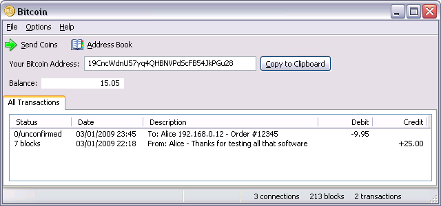
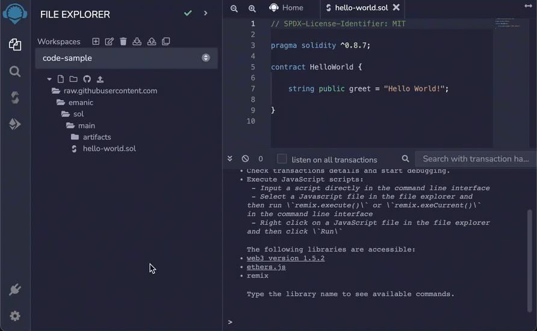
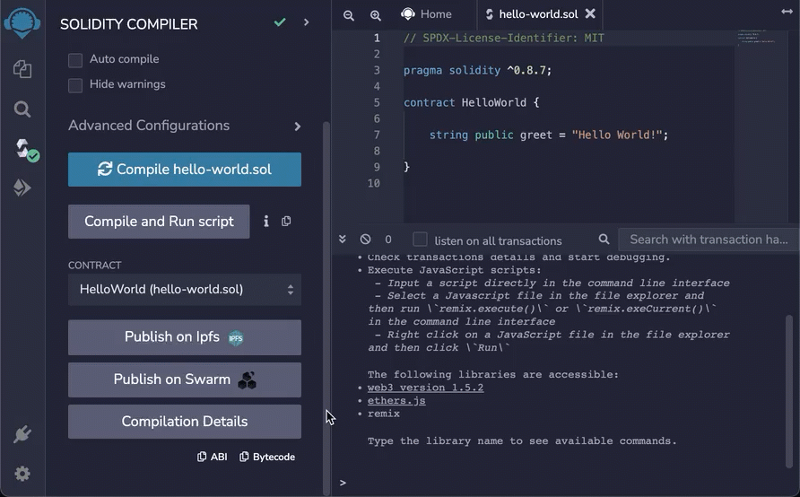
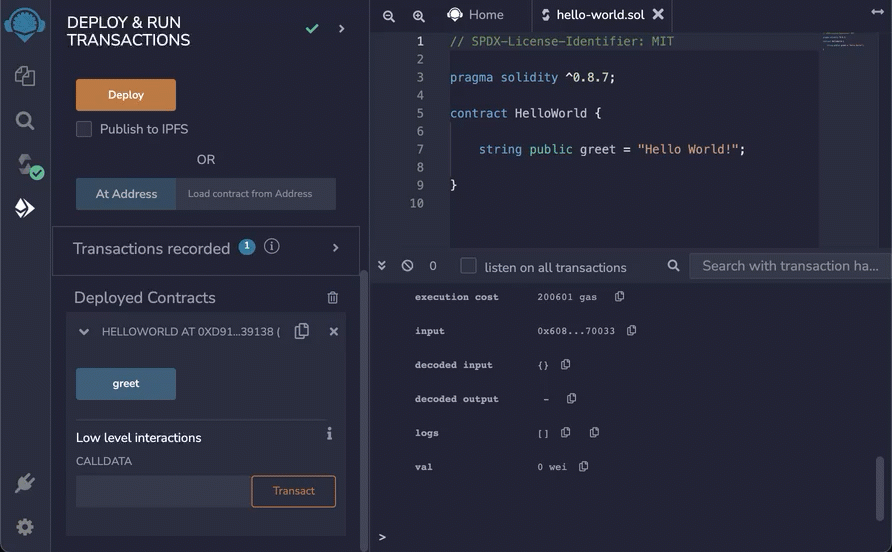

# Welcome to Solidity

## About Solidity

Solidity makes it easier to write decentralized applications that run on blockchains like [Ethereum](https://ethereum.org/en/) and [Hyperledger Fabric](https://www.hyperledger.org/use/fabric). 

It resembles popular scripting languages like JavaScript with its use of curly brackets, but also supports object-oriented patterns such as inheritance. A high-level language, it gets compiled into bytecode that runs on Ethereum Virtual Machines (EVMs). You must specify variable types: Solidity does not infer them. It is a statically typed language.

Before we dive into Solidity, let's go over a few concepts.

## Core concepts

### Bitcoin

In 2008, the pseudonymous Satoshi Nakamoto published [Bitcoin: A Peer-to-Peer Electronic Cash System](https://bitcoin.org/bitcoin.pdf), describing how to use a network to exchange money without a middleman. Participants in the Bitcoin network rely on cryptographic proofs to conduct transactions instead of trusted third parties like financial institutions. Satoshi's white paper remains one of the best resources for understanding the Bitcoin protocol. It solved problems that had confounded cryptographers for decades, such as the [Byzantine General's Problem](https://lamport.azurewebsites.net/pubs/byz.pdf) and [Sybil attacks](https://www.freehaven.net/anonbib/cache/sybil.pdf). Satoshi followed up his white paper with the [release of Bitcoin version 0.1](https://satoshi.nakamotoinstitute.org/emails/cryptography/16/) in 2009 as open-source software. 



### Proof-of-work

Current blockchains use proof-of-work to validate blocks, also called mining. Proof-of-work was Satoshi's key innovation, well-described in his white paper. Though proof-of-work requires a considerable amount of energy, it's the only proven way to prevent [Sybil attacks](https://www.freehaven.net/anonbib/cache/sybil.pdf). To maximize efficiency, Bitcoin miners use [specially designed application-specific integrated circuit (ASIC) chips](https://en.bitcoin.it/wiki/List_of_Bitcoin_mining_ASICs), while Ethereum miners use graphics processing units (GPUs). In the future, blockchains may transition to [proof-of-stake](https://csrc.nist.gov/glossary/term/proof_of_stake_consensus_model), which would require far less computation and render miners defunct.

### Ethereum

Since its [proposal in 2013](https://ethereum.org/en/whitepaper/), Ethereum has become the second-most popular blockchain. Ethereum built upon the existing Bitcoin protocol to become [Turing-complete](https://csrc.nist.gov/glossary/term/turing_complete), facilitating the development of decentralized applications. Whereas the Bitcoin network maintains a distributed ledger, Ethereum constitutes a distributed [state machine](https://xlinux.nist.gov/dads/HTML/statemachine.html). 

### Ethereum virtual machine

[Introduced in 2018](https://ethereum.github.io/yellowpaper/paper.pdf), Ethereum virtual machines (EVM) provide the runtime environment for the Ethereum network. They use a stack data model (last in, first out) to process transactions. For more details, review [Ethereum virtual machine (EVM)](https://ethereum.org/en/developers/docs/evm/) in the Ethereum documentation.

### Decentralized application

Distributed across the nodes in a [peer-to-peer network](https://datatracker.ietf.org/doc/html/rfc5694), decentralized applications (dapps) interact directly with each other and users. Most dapps today use the Ethereum protocol. [Chainlink](https://chain.link/) is an example of a dapp built on Ethereum. 

### Smart contract

Nick Szabo came up with the [idea of smart contracts in 1997](https://nakamotoinstitute.org/the-idea-of-smart-contracts/), using the analogy of a digital vending machine. You need only insert a coin to obtain the desired product or result. 

Smart contracts contain the backend code of dapps. They get deployed to blockchains, assuming the same traits as other blocks.

- **Public**: anyone can examine and decompile the bytecode of your smart contract once it's deployed.

- **Immutable**: you must conduct extensive testing before deploying a smart contract as they're difficult to modify afterwards. 

Due to the expense associated with proof-of-work validation, smart contracts are not well-suited to complex processing tasks or handling large quantities of data. Most dapps store bulky data off-chain, using services like [InterPlanetary File System (IPFS)](https://docs.ipfs.io/) or [Swarm](https://docs.ethswarm.org/docs/).

Check out [Introduction to smart contracts](https://ethereum.org/en/smart-contracts/) on the Ethereum website for more information.

### Gas

To prevent denial of service attacks and discourage inefficient code, Ethereum institutes a fee system measured in units called gas. Each operation costs a certain amount of gas, correlated to its processing and storage requirements. You must specify the following values up front. 

- **Gas limit**: maximum number of ETHs you're willing to spend to process the transaction
- **Gas price**: how many ETHs you're willing to pay for each gas unit

Miners use these values to decide whether or not to process the transaction.

The EVM deducts the maximum cost of the transaction from your account at the beginning of the transaction and refunds the remainder at its conclusion. If you run out of gas mid-transaction, the EVM aborts your transaction and does not refund the amount already spent. 

If you reduce the state size to zero or issue a self-destruct command, the EVM refunds you some gas.

To learn more, refer to [Gas and fees](https://ethereum.org/en/developers/docs/gas/) in the Ethereum documentation.

### Accounts

Ethereum uses two types of accounts.

- **External**: free to create, secured by private keys, functionality limited to sending/receiving cryptocurrency and initiating transactions with contract accounts

- **Contract**: contains smart contract code that executes in response to requests from external accounts

Refer to [Accounts](https://ethereum.org/en/developers/docs/accounts/) in the Ethereum documentation for additional context.

## Getting started

Now that you understand the basics, let's deploy a simple smart contract. 

1. Open our [hello-world.sol file in the Remix IDE](https://remix.ethereum.org/#url=https://raw.githubusercontent.com/emanic/sol/main/hello-world.sol). The following bullet points describe each line in the file.

    - Start by specifying the license you're releasing under, using a [machine-readable SPDX license identifier](https://spdx.org/licenses/). 

      ```solidity
      // SPDX-License-Identifier: MIT
      ```

      > For more discussion on licenses, take a look at the [Solidity documentation](https://docs.soliditylang.org/en/latest/layout-of-source-files.html#spdx-license-identifier).

    - Next, tell the compiler which version of Solidity to use, using the `pragma` keyword. The following example instructs the compiler to use a version of Solidity greater than or equal to 0.8.7 and less than 0.9. 
    
      ```solidity
      pragma solidity ^0.8.7;
      ```

      > Refer to the [Solidity documentation](https://docs.soliditylang.org/en/latest/layout-of-source-files.html#pragmas) to understand more.

    - We then create a contract named `HelloWorld`.

      ```solidity
      contract HelloWorld { 
          ...
      }
      ```

    - Inside our contract, we set a `greet` variable to the string `Hello World!`.

      ```solidity
      string public greet = "Hello World!";
      ```

1. Use the Remix web interface to compile our SOL file.

    

1. Deploy the smart contract to a VM.

    

1. Click the **greet** button to execute the contract.

    

Congratulations! You've compiled, deployed, and executed a simple hello world smart contract. Next:

- Refer to the [Solidity documentation](https://docs.soliditylang.org/en/latest/) to learn how to extend your dapp. 
- [Solidity by example](https://solidity-by-example.org/) provides extensive sample code. 
- We also offer a [Cheatsheet](#cheatsheet) below for your convenience.

## Cheatsheet

### Basic syntax

```solidity
// SPDX-License-Identifier: MIT
pragma solidity ^0.8.0;

// you can import various things from files using their filenames
import "filename";
import * as justgivemeeverything from "filename";
import {thing1 as alias, thing2} from "filename";

// declare a contract
contract SimpleContract {

    // declare state variable
    uint storedData;

    // declare modifier
    modifier onlyData() {
        require (
            storedData >= 0 );
            _);
    }

    // declare function
    function set(uint x) public {
        storedData = x;
    }

    // declare event
    // (similar to JavaScript events)
    event Sent(address from, address to, uint storedData);

}
```

### Contracts

Contracts resemble classes in object-oriented languages. They can contain:

- [Variables](#variables)
- [Modifiers](https://docs.soliditylang.org/en/latest/structure-of-a-contract.html#function-modifiers) (conditions that must run before functions)
- [Constructors](https://docs.soliditylang.org/en/latest/contracts.html#constructors)
- [Functions](https://docs.soliditylang.org/en/latest/structure-of-a-contract.html#functions)

### Types

#### About types

You must declare the type of each variable. Solidity has no concept of `null` or `undefined`.

#### Address

Allows you to specify the address of a  wallet. Holds a 20-byte Ethereum address. 

```solidity
address payable public mywallet = 0xf753ku;
```

#### Array

```solidity
type[] myArray;
```

#### Boolean

```solidity
bool myboolean = false;
```

#### Byte

Number of bytes can be declared from 1-32 or inferred from the value.

```solidity
bytes32 myBytes;
```

#### Enum

```solidity
enum userType {buyer, seller};
```

#### Mapping

Resemble dictionaries in other languages. Contain key-value pairs.

```solidity
mapping(address => uint) public balances;
```

#### Integer

```solidity
uint myInteger = 34;
```

#### String

```solidity
string myString = “initial string value”;
```

#### Struct

To create your own type. Usually used to represent the different entities in the contract. 

```solidity
struct User {
  string firstName;
  string lastName;
}
```

#### Reserved types

The following types are reserved. You cannot create new variables with these names.

- `ether`
- `finney`
- `szabo`
- `wei`

#### Time units

- `days`
- `hours`
- `minutes`
- `seconds`
- `weeks`

> TIP: Time units always take the plural form.

> NOTE: Due to leap seconds, not every day contains 24 hours and not every year contains 365 days. You may need to use an external oracle for accurate time calculations.

### Variables

#### About variables

Solidity supports three types of variables.

- **local**: declared inside a function; the value is stored until the function stops executing
- [**state**](https://docs.soliditylang.org/en/latest/structure-of-a-contract.html#state-variables): value stored permanently in the contract account
- **global**: special variables that exist in the global namespace; used to get information about the blockchain

Variable names can optionally begin with an underscore, but not a numeral.

#### Global variables

##### Block

The `block` contract built into Solidity exposes a number of variables about an Ethereum block in the blockchain such as its number, difficulty, and the miner's address.

```solidity
contract BlockData {
  block.number;
  block.difficulty;
  block coinbase ();
}
```

##### Message

You can access a number of variables in the built-in `msg` class such as a message's sender, value, and metadata.

```solidity
contract GetMsgInfo {
  msg.sender;
  msg.value;
  msg.data;
}
```

##### Transaction

Once a transaction completes, you can access various data about it like its origin.

```solidity
contract CheckTxOrigin {
  tx.origin;
}
```

### Functions

Unlike other programming languages, functions in Solidity can return more than one thing. 

Functions can be public or private. Private functions can only be called from within the contract. 

Parameter variable names are prefixed with an underscore. 

```solidity
contract FunctionDemo {
  function myFunction(uint _a, uint _b) public pure
  returns (uint o_sum, uint o_product) {
    o_sum = _a + _b;
    o_product = _a * _b;
  }
}
```

### Constructor

Called once when the contract is created. When complete, your code gets deployed.

### Operators

#### Arithmetic

| Operator | Description |
| :-- | :-- |
| `-` | subtract |
| `+` | add |
| `*` | multiply |
| `/` | divide |
| `%` | remainder |
| `**` | exponent |

> NOTE: The exponent operator makes the number on the right the exponent of the number on the left. For example, `2 ** 3` would result in 2<sup>3</sup> or two to the power of three.

#### Bitwise

| Operator | Description |
| :-- | :-- |
| `&` | and |
| `|` | or |
| `^` | exclusive or |
| `~` | negation |
| `>>` | right shift |
| `<<` | left shift |

> EXAMPLE: `bytes1 twoOrOne = 0x02 | 0x01;`

#### Logical

| Operator | Description |
| :-- | :-- |
| `!` | not |
| `&&` | and |
| `||` | or |
| `==` | equals |
| `!=` | not equal|

> EXAMPLE: `bool itsTrue = !false;`

### Conditionals

#### Do while loops

Run code, then check a condition. The code runs until the condition becomes false.

```solidity
contract DoWhile {
  do {
    // run this code
  } while a >= 0
}
```

#### For loop

```solidity
contract For {
  for (uint i=0, i>=50, i++) {
    //run this code
  }
}
```

#### If statements

```solidity
contract If {
  if a == 2 {
    // run this code
  } else {
    // run this code
  }
}
```

#### While loop

Use while statements to check a condition before running code.

```solidity
contract While {
  while a >= 0 {
    // run this code
  } 
}
```
